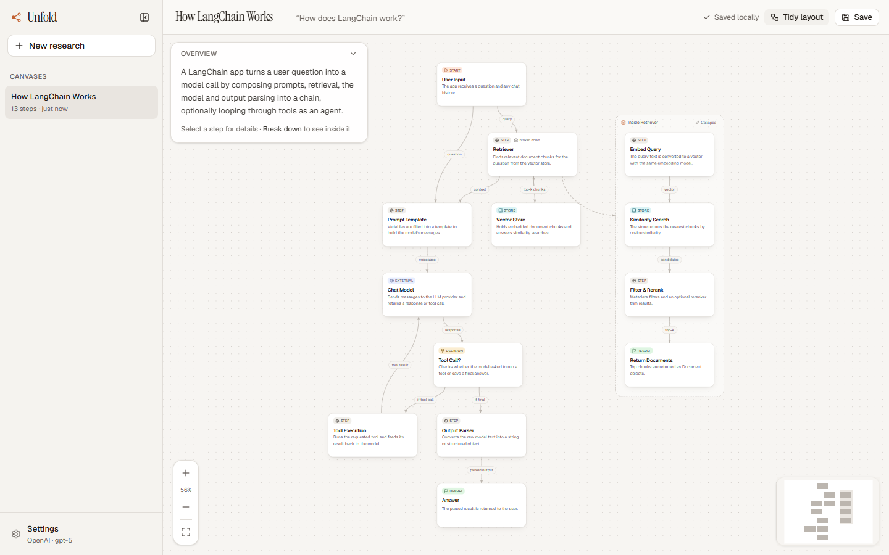
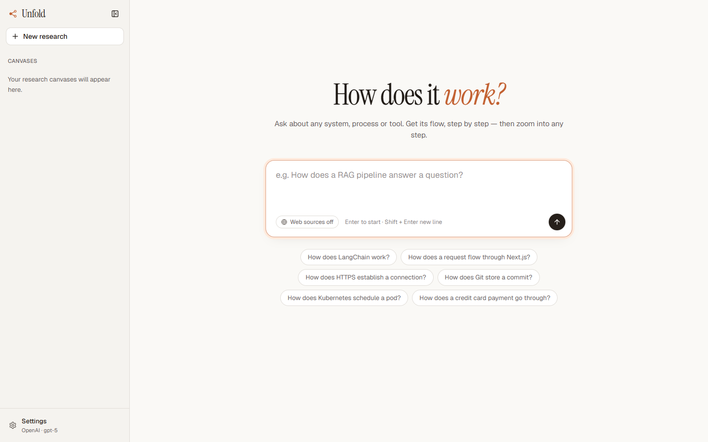
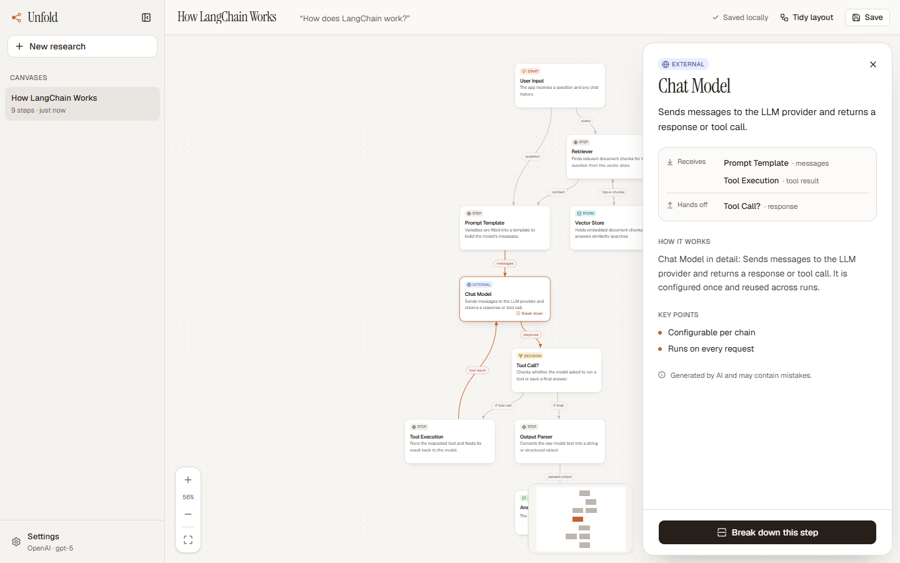
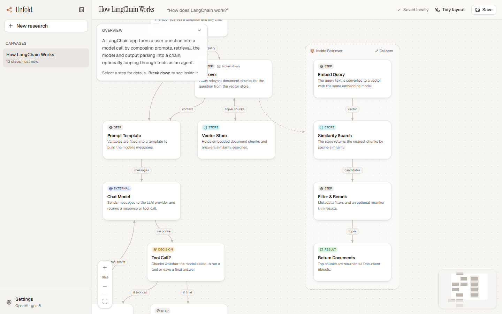
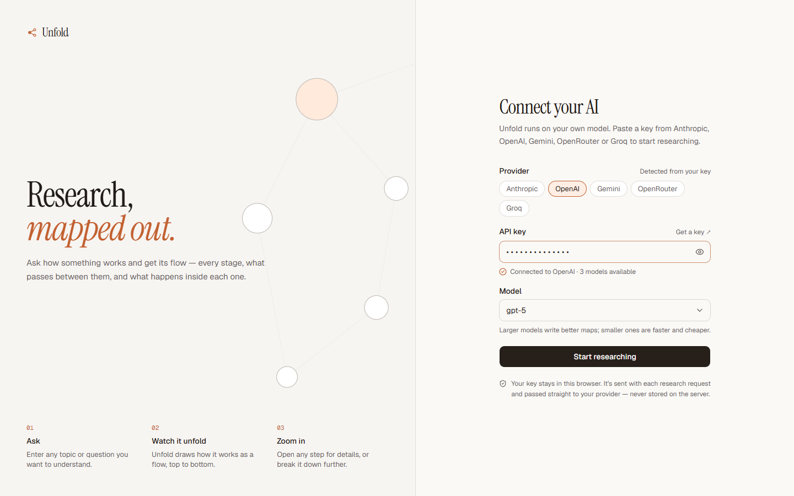

# Unfold

**Ask how something works. Get the flow.**

Unfold turns questions like *"How does LangChain work?"* or *"How does Kubernetes schedule a pod?"* into an interactive flow diagram. Each step is a stage or component, each arrow is labelled with what passes along it, and the whole thing reads top to bottom. Click any step to see what it receives, what it hands off and how it works. You can also break a step down into its own sub-flow.



---

## Why

Chat assistants explain systems as long paragraphs. You read about the retriever, then the prompt, then the model, and have to rebuild the order and the connections in your head.

Unfold gives you that picture directly:

- **Order:** where the flow starts, what runs next, and where it ends.
- **Connections:** what data or control passes between steps (`query`, `embeddings`, `if tool call`).
- **Structure:** branches for decisions, arrows back for loops such as retries and agent cycles.
- **Depth on demand:** the top level stays readable. Break down only the steps you care about.

## Features

| | |
|---|---|
| **Flow diagrams** | Steps are typed as Start, Step, Decision, Store, External or Result, laid out top to bottom with labelled arrows. |
| **Break down any step** | Generates what happens inside a step as a boxed sub-flow beside it. Breakdowns can be nested and collapsed. |
| **Step details** | What the step receives and hands off (click to jump to that step), how it works, and key points. |
| **Bring your own AI** | Works with Anthropic, OpenAI, Gemini, OpenRouter or Groq. Paste a key, and Unfold detects the provider and lists the models the key can use. |
| **Optional web sources** | With a Tavily key on the server, a toggle searches the web first and cites sources on each step. |
| **Saved locally** | Canvases autosave in the browser. You can rename, delete and reopen them, and research keeps running if you leave the page. |
| **Canvas tools** | Pan, zoom, fit to view, minimap, drag to rearrange, and **Tidy layout** to reset the arrangement. |

<table>
  <tr>
    <td></td>
    <td></td>
  </tr>
  <tr>
    <td align="center"><sub>Ask a question</sub></td>
    <td align="center"><sub>Inspect a step</sub></td>
  </tr>
  <tr>
    <td></td>
    <td></td>
  </tr>
  <tr>
    <td align="center"><sub>Break a step down</sub></td>
    <td align="center"><sub>Connect any provider</sub></td>
  </tr>
</table>

<sub>Screenshots use sample data.</sub>

---

## Quick start

**Requirements:** Node.js 20.9 or later, and an API key from any supported provider.

```bash
git clone <your-repo-url> unfold
cd unfold
npm install
npm run dev
```

Open [http://localhost:3000](http://localhost:3000), paste your AI key and pick a model, then ask *"How does ___ work?"*

### Optional: web sources

To let users ground flows in live web results, add a [Tavily](https://app.tavily.com) key:

```bash
cp .env.example .env.local
# then set TAVILY_API_KEY=tvly-...
```

Restart the dev server and a **Web sources** toggle appears on the home screen. It's off by default.

| Web sources | Speed | Best for |
|---|---|---|
| Off (default) | ~10–40s | Established tech and processes the model already knows well |
| On | ~20–60s | New releases, niche tools, or when you want cited links |

---

## Supported providers

Unfold detects the provider from the key prefix. You can also pick it manually.

| Provider | Key looks like | Notes |
|---|---|---|
| Anthropic | `sk-ant-…` | Defaults to Claude Opus 5 when available |
| OpenAI | `sk-…` | Chat models only; audio, image and embedding models are filtered out |
| Gemini | `AIza…` | Google AI Studio key |
| OpenRouter | `sk-or-…` | Any text model on OpenRouter; type to search the list |
| Groq | `gsk_…` | Fast open-weight models |

**Your key stays in your browser.** It's kept in `localStorage`, sent with each request over your connection to the Unfold server, and forwarded directly to the provider. The server never logs or stores it.

---

## How it works

```
Question ──► POST /api/research ──► LangGraph workflow ──► streamed NDJSON ──► React Flow canvas
                                     │
                                     ├─ [plan → search]   only with web sources on
                                     ├─ generate          LLM draws steps + labelled links
                                     └─ validate          links must hit real steps,
                                                          disconnected steps dropped,
                                                          one retry if the flow falls apart
```

- **Grounded links only:** with web sources on, a step can cite sources only by number, and only URLs actually returned by search are attached. The model can't invent URLs.
- **Works across providers:** each provider's native structured output is tried first (JSON schema or tool calling). Models without it fall back to JSON-only prompting, validated with Zod.
- **Breakdowns** reuse the same workflow, with the step's inputs and outputs as context.
- **Layout** is computed with [dagre](https://github.com/dagrejs/dagre) and runs top to bottom. Sub-flows are placed beside their parent step without overlapping anything.

See **[FLOW.md](FLOW.md)** for the full walkthrough: every stage, data shape and file.

---

## Tips

- **Phrase it as a process:** *"How does X work?"*, *"What happens when…"* and *"Walk me through…"* give the best flows. *"What is X?"* still works, but you'll get how X is used.
- **Break down the step you're curious about** instead of asking a broader question.
- **Tidy layout** re-arranges the canvas after you've dragged things around.

| Shortcut | Action |
|---|---|
| `Ctrl/⌘ + S` | Save now |
| `F` | Fit to view |
| `+` / `-` | Zoom |
| `Esc` | Close the details panel |
| `Tab`, then `Enter` | Move between steps and select |

---

## Tech stack

| Layer | Choice |
|---|---|
| Framework | [Next.js 16](https://nextjs.org) (App Router, TypeScript) |
| UI | [Tailwind CSS 4](https://tailwindcss.com), [shadcn/ui](https://ui.shadcn.com) (Base UI), [Framer Motion](https://motion.dev), [Lucide](https://lucide.dev) |
| Canvas | [React Flow](https://reactflow.dev) (`@xyflow/react`) + [dagre](https://github.com/dagrejs/dagre) |
| AI orchestration | [LangChain.js](https://js.langchain.com) + [LangGraph.js](https://langchain-ai.github.io/langgraphjs/) |
| Providers | `@langchain/anthropic`, `@langchain/openai` (also OpenRouter and Groq), `@langchain/google-genai` |
| Search (optional) | [Tavily](https://tavily.com) |
| Persistence | Browser `localStorage` |

## Project structure

```
app/
  page.tsx                   Home: prompt, web-sources toggle, examples, recent canvases
  canvas/[id]/page.tsx       Workspace: progress, error, or canvas
  api/research/route.ts      Streaming research endpoint
  api/keys/verify/route.ts   Key check and model list
  api/config/route.ts        Reports whether web search is available
components/
  key-gate.tsx, key-form.tsx Onboarding and settings (bring your own key)
  app-sidebar.tsx            Canvas list, rename and delete
  canvas/                    Step cards, sub-flow groups, arrow edges, detail panel, controls
  workspace/                 Header, progress, error states
lib/
  ai/                        LangGraph workflow, prompts, model factory, structured output, search
  layout.ts                  dagre layout, sub-flow placement, tidy
  providers.ts               Provider list and key detection
  storage.ts                 localStorage stores for settings and canvases
  types.ts                   Data model
docs/screenshots/            README images
```

## Scripts

| Command | What it does |
|---|---|
| `npm run dev` | Start the dev server on port 3000 |
| `npm run build` | Production build (type-checks too) |
| `npm run start` | Serve the production build |
| `npm run lint` | ESLint |

---

## Deploying

Unfold is a standard Next.js app and runs anywhere Next.js does. Check these first:

- **Serve over HTTPS.** Users' AI keys travel in request headers.
- **Allow long requests.** `/api/research` streams for up to about 2 minutes (`maxDuration = 120`), so your host's function time limit must be at least that.
- **Protect your Tavily key if you enable it.** Anyone who can reach your deployment and has any working AI key can trigger web searches that use your Tavily credits. Before a public launch, add rate limiting or authentication, or leave `TAVILY_API_KEY` unset.

## Limitations

- **Flows are AI-generated** and can be wrong or oversimplified. Check anything important, or turn on web sources for cited links.
- **Canvases live in one browser.** There are no accounts or sync yet, and clearing site data deletes them.
- **Canvases from the earlier concept-map version** need regenerating. Unfold offers this when you open one.
- **No export or sharing yet.**

## Roadmap

- Export as PNG, SVG or Markdown
- Shareable read-only links
- Accounts and cloud sync
- Search within a canvas
- Rate limiting for hosted deployments
